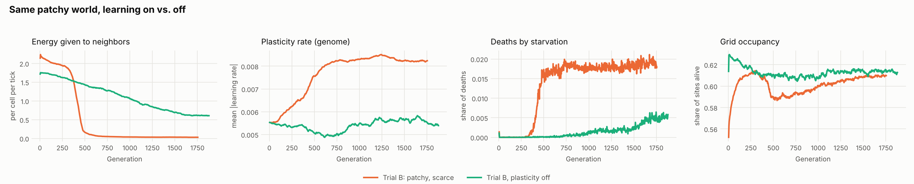
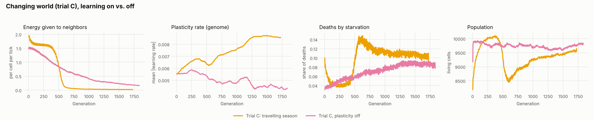
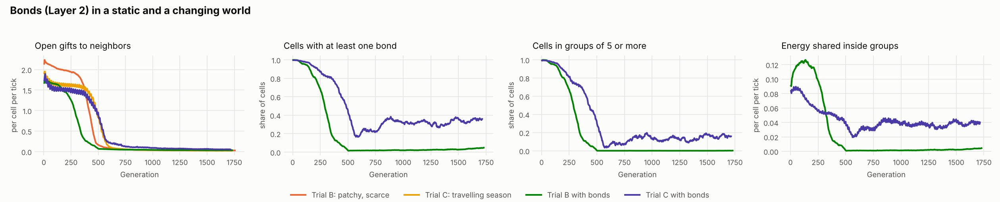
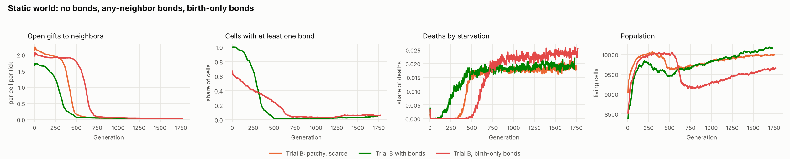
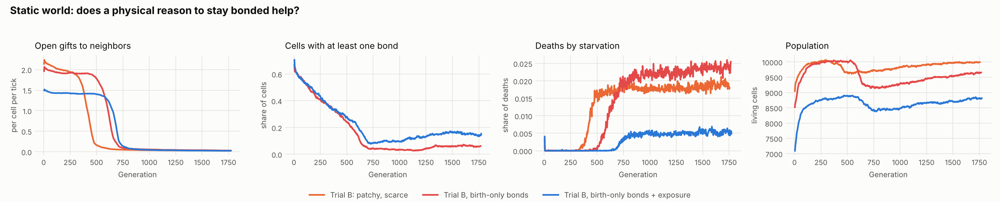
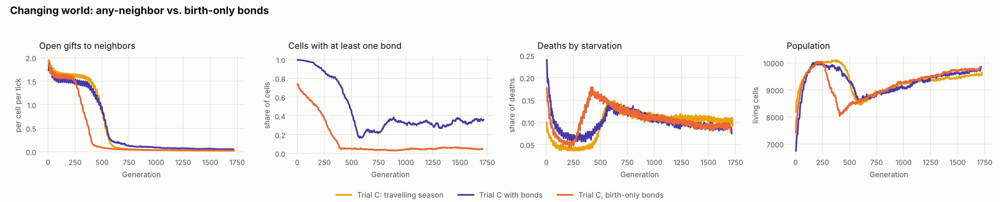
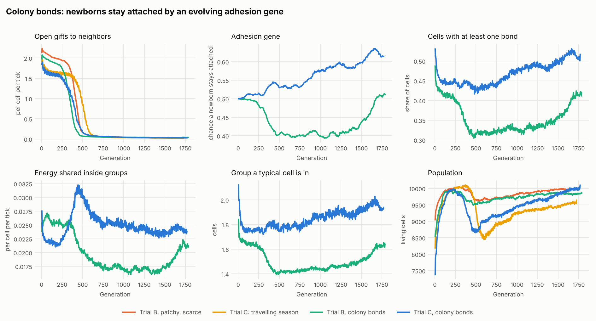

# Substrata Lab Notebook

A running record of experiments with Substrata, a cellular automaton whose cells learn, form collectives, and evolve how they learn. Newest entries at the bottom. Each entry states what was run, what happened, and what it might mean, keeping observations separate from interpretation.

- Design and assumptions: [docs/design-principles.md](../docs/design-principles.md)
- Charts: `reports/figures/`, rebuilt with `python reports/make_charts.py charts`
- Data behind the charts: `reports/data/` (smoothed, one row per 500 ticks)

---

## Findings so far

Status key: **observed** (seen in data), **supported** (seen more than once, or with a control), **open** (a hypothesis not yet tested).

1. **Sharing collapses once lineages diverge.** *Supported (2 of 2 worlds).* Cells gave about 2 energy per tick to their neighbors for hundreds of generations, then a non-sharing lineage swept the population and giving fell to almost zero. It happened in both trial A (generation ~850 to 1,000) and trial B (~300 to 500).
2. **Kin selection explains the collapse.** *Open.* Sharing is cheap when neighbors are relatives and costly when they aren't. Test: the Layer 3 "off" control keeps every cell a clone, so this predicts sharing never collapses there.
3. **Scarcity shrinks brains.** *Observed (trial B).* Under patchy, scarce energy, the share of the network in use fell steadily (active weights 0.22 to 0.18). With plentiful energy (trial A) it did not fall until late in the run.
4. **Sharing was feeding the frontier.** *Observed (trial B).* Starvation began exactly when sharing collapsed, and occupancy dipped. Before the collapse, energy passed from rich patches kept edge cells alive.
5. **The plasticity rate is under selection, not drifting.** *Supported (control run).* The genome's learning rate rose about 50% in both plastic worlds. In the plasticity-off control, where those genes do nothing, it stayed flat. The plateau near 0.0082 may still be the engine's ceiling of 0.01.
6. **Over a whole run, learning did not pay for the population.** *Supported (2 of 2 worlds).* With learning switched off, both trial B and trial C held more cells (1 to 4%) with less starvation.
7. **Learning turns the sharing collapse into a sweep.** *Supported (2 of 2 worlds).* With learning on, sharing crashed within about 150 generations (around generation 400 to 600). With learning off, it eroded gradually. The plasticity rate rose during the same window as each sweep.
8. **In a changing world, learning paid until the sweep.** *Observed (trial C).* Before its collapse, the learning world held about 2% more cells with less starvation than the no-learning world. In trial B, which does not change, it never had that edge. The sweep then cost the learning world about 12% of its population.
9. **Bonds did not protect sharing, whether open to any neighbor or limited to families.** *Observed (3 runs).* Open gifts still collapsed. Any-neighbor bonds brought the collapse earlier (generation ~280 vs. ~415 in the static world); birth-only bonds delayed it (to ~610) but did not stop it. In every case cells broke their bonds and groups shrank to a few cells.
12. **Flexible bonds, not family bonds, are what survive in a changing world.** *Observed (1 comparison).* With birth-only bonds in trial C, bonds vanished by generation 400 and sharing collapsed earliest of any C run. With any-neighbor bonds, a third of cells stayed in groups. Insurance needs to be able to re-form with whoever is next door.
13. **A physical reason to stay bonded (exposure) delayed the collapse but did not stop it.** *Observed (1 run).* Sharing held until generation ~650, the latest yet, and bonds recovered slightly late in the run (15% vs. 5%), but groups stayed tiny and the leak cost the world about 12% of its population.
10. **Bonded groups persisted only in the changing world, and they are not families.** *Observed (1 comparison, kinship checked).* With the travelling season, about a third of cells stayed bonded, in groups where a typical cell had about 9 group-mates (largest about 180; corrected 2026-10-08, see entry 9), and kept sharing energy inside them. In the static world almost every bond was gone by generation 500. A shared pool works like insurance when local conditions swing. Bonded partners are no more related than any other neighbors.
11. **The starting clone bonded into one world-spanning group.** *Observed.* Early on, 99% of cells were bonded into a single connected network covering nearly the whole population: no membrane and no separate groups, just one commons.
14. **When cells cannot leave their group, a changing world selects for staying together.** *Observed (1 run).* In colony mode, the adhesion gene rose from 0.50 to about 0.61 over the run in trial C, sharing inside groups persisted, and the world ended about 4.5% larger than plain trial C. In the static world adhesion first fell, then recovered. Open gifts still collapsed in both.
15. **No design so far has produced large or long-lived groups.** *Supported (6 bond runs, corrected metrics).* Outside the early world-spanning commons, a typical bonded cell has been in a group of 1 to 2 cells (about 9 at most, in the changing world with any-neighbor bonds). Groups break when members die, so group-level selection has not really been tested.

---

## Entry 1: GPU benchmark (2026-10-06)

**Setup.** A stand-in tick with the same cost shape as the engine (neighbor messages, per-cell networks with genome masks, a plasticity update on every weight, energy bookkeeping), timed across grid sizes 64 to 256, hidden widths 8 to 64 and message widths 4 to 16 on the RTX 4070 Super.

**Observed.**
- Throughput is about 4.5 billion weight updates per second, roughly the same however it is split between number of cells and network size.
- Memory only binds at the largest case (256 x 256, hidden 64, message 16: 11.3 GB, 1.3 ticks per second).
- The plasticity update dominates the cost, since it rewrites every weight every tick.

**Decision.** Option A: 128 x 128 grid, hidden 32, message 8 (about 65 ticks per second in the benchmark, about 38 in the full engine).

---

## Entry 2: Trial A, uniform plentiful energy (2026-10-06)

**Setup.** 128 x 128 torus, uniform inflow 0.5 per site per tick, one random genome cloned into 30% of sites, plasticity on, Layer 3 on (mutation rate 0.02), no bonds. 300,000 ticks, about 1,840 generations. Run `trial_a_20261006-134953`.

**Observed.**
- The grid filled within a few hundred ticks and stayed about 99.7% full. No cell ever starved; every death was from old age. Space, not energy, was the limit.
- Generation time was about 160 ticks, about half the 300-tick lifespan, because cells reproduce as soon as a neighbor dies.
- **Generations 850 to 1,000:** energy given to neighbors fell from 2.0 to 0.03 per cell per tick and never recovered. Genetic diversity dropped about 30% during the same window, then rebuilt to above its earlier level by the end of the run. Message bandwidth doubled (3.2 to 7.5) at the same moment and stayed high.
- Energy lost to full storage climbed sharply after the collapse: cells that stopped giving filled their tanks.
- The winning lineage briefly had larger networks (active weights spiked to 0.26), which then shrank steadily for the rest of the run.

**Interpretation.**
- The diversity dip and recovery is the signature of a selective sweep: one lineage, carrying the trait that mattered, took over and then diversified.
- Not sharing was the trait that mattered. A cell that keeps its energy returns to the reproduction threshold sooner and wins more of the freed sites.
- The bandwidth jump is most likely hitchhiking: the winning lineage happened to message loudly, and messages are cheap. Nothing yet shows messages carry useful information.

**Against the trial criteria.** Floor met (alive, turnover continued, no frozen monoculture). Learning paying off not tested. Structure beyond chance not applicable (no bonds yet).

---

## Entry 3: Trial B, patchy scarce energy (2026-10-06)

**Setup.** As trial A, except mean inflow 0.35 arranged in smooth rich patches and poor zones (contrast 0.8, patch scale 16). About 39% of site-ticks fall below what a typical early cell spends. 300,000 ticks, about 1,755 generations. Run `trial_b_20261006-160817`.

**Observed.**
- The world held about 10,000 cells (about 60% of sites). The poor zones stayed mostly empty. Cells sat on inflow about 1.4 times the grid average, which reflects where cells can survive rather than a choice, since cells cannot move.
- **Sharing collapsed again**, earlier than in trial A: from about 2.0 to near zero between generations 300 and 500, with the same diversity dip and recovery and the same bandwidth jump.
- **Starvation began at the collapse.** Before generation ~300 essentially no cell starved. Afterward about 2% of deaths were starvation, occupancy dipped from 0.61 to 0.59, and energy lost to full storage jumped in the rich patches.
- Brains shrank steadily from generation ~250 on: active weights 0.22 to 0.18, expressed hidden units 0.43 to 0.35.

**Interpretation.**
- The same event in two different worlds makes the collapse a property of the system, not an accident of one run.
- It came sooner under scarcity. Sharing is more costly when energy is tight, so the selfish strain's advantage was larger.
- Sharing had been doing real work: it carried energy from the rich patches to the frontier. When it went, the frontier starved and the rich patches overflowed. The population as a whole became less efficient, even though each selfish lineage did better. This is the classic shape of a tragedy of the commons.
- Brains shrink when compute costs energy that is actually scarce. That is the pressure toward efficient networks the substrate was designed to create.

**Caveat on learning.** The plasticity rate rose in both runs and leveled near 0.0082 against a built-in ceiling of 0.01. Weight drift (how far learned weights move from the inherited ones) rose and fell with the sweeps. Neither shows that learning helps. Raising the ceiling would tell whether the plateau is the ceiling or a real optimum.

---

## Entry 4: Trial B, plasticity off (2026-10-07)

**Setup.** Identical to trial B (same seed, same patchy field, same starting clone) with Layer 1 learning switched off: cells live their whole lives with the weights they inherited. 300,000 ticks, about 1,880 generations. Run `trial_b_noplast_20261006-184011`.

**Question.** Does learning during life pay in a patchy, scarce world?

**Observed.**

| Measure (generations ~950 to 1,850) | Learning on | Learning off |
|---|---|---|
| Population | 9,909 | 10,042 |
| Mean cell energy | 31.5 | 33.9 |
| Deaths by starvation | 1.8% | 0.3% |
| Energy given to neighbors (per cell per tick) | 0.03 | 0.78 |
| Plasticity rate (genome) | 0.0083 | 0.0056 |
| Active weights (share of network) | 0.19 | 0.20 |

- **No advantage for learning.** The learning-off world was slightly larger and better fed throughout the run, and starvation stayed near zero far longer.
- **No sharp sweep without learning.** Sharing drifted down gradually from about 1.7 to 0.6 per tick across the whole run, with no diversity dip. With learning on, it crashed from about 2.0 to near zero between generations 300 and 500.
- **The plasticity rate stayed flat without learning** (0.0055 at the start, 0.0054 at the end), while it rose about 50% with learning on. With learning off those genes have no effect, so this run is a clean drift baseline for them.
- Message bandwidth was lower throughout without learning (about 4.7 vs. 7.5 late in the run).

**Interpretation.**
- The learning rule here is Hebbian: it has no reward signal, so cells are not "learning" that selfishness pays. A more likely reading is that a plasticity gene is a powerful lever. One mutation to the learning rule can change how every weight drifts over a lifetime, including the weights that control giving. A lineage whose rule happened to shut off giving during life gained the selfish advantage all at once, which looks like a sweep. Without plasticity, the same change has to accumulate weight by weight, which looks like slow erosion.
- If that is right, learning made the population more *evolvable*, and in this world evolvability was spent on defection. This is a hypothesis; it could be tested by checking whether the winning lineage's weights move toward less giving during each lifetime.
- The outcome is a useful negative: in a world where the main pressure is a social dilemma and nothing changes within a lifetime, learning during life has little to offer and can make the commons collapse faster. Trial C (a season that changes within a lifetime) is the world where learning should have its best chance.

---

## Entry 5: Trial C, a changing world, learning on and off (2026-10-07)

**Setup.** Trial B's patchy field (mean inflow 0.35), plus a season that travels across the grid: each place swings between rich and poor every 600 ticks (amplitude 0.6), about four generations per cycle. Two runs, same seed, learning on and off. 300,000 ticks each, about 1,720 and 1,830 generations. Runs `trial_c_20261007-082346` and `trial_c_noplast_20261007-110424`. (Two short false starts from the same morning are not included.)

**Question.** Does learning during life pay when conditions change within a lifetime?

**Observed.**

| | Learning on | Learning off |
|---|---|---|
| Population, generations 150 to 450 | 9,996 | 9,790 |
| Starvation, generations 150 to 450 | 4.3% | 5.2% |
| Population, generations 550 to 700 | 8,604 | 9,765 |
| Starvation, generations 550 to 700 | 13.7% | 6.6% |
| Population, second half of run | 9,366 | 9,696 |
| Energy given to neighbors, second half | 0.03 | 0.27 |
| Plasticity rate, second half | 0.0083 | 0.0046 |
| Active weights, second half | 0.17 | 0.21 |

- **Learning had an early edge.** For roughly 300 generations the learning world was larger and starved less. The same comparison in trial B showed no edge.
- **Then the sweep.** Between generations about 450 and 600, sharing in the learning world fell from 1.3 to 0.1. Population dropped to about 8,500 and starvation tripled to 14%. It recovered slowly but never caught up with the no-learning world.
- **Without learning, sharing eroded steadily** from 1.4 to 0.2 over the run, faster than in trial B but with no sweep.
- **The plasticity rate rose again** to near the 0.01 ceiling, while it drifted slightly down without learning. Learning worlds also ended with smaller networks (0.17 vs. 0.21 of the maximum).

**Interpretation.**
- Trial C gives the first sign that learning helps when conditions change within a lifetime, and none when they don't. That is the expected pattern, but it rests on one pair of runs and a small margin.
- In both worlds, the same evolutionary lever that makes learning flexible also lets a selfish lineage sweep, and the sweep costs more than learning gains. Criterion 2 is met only before the sweep.
- **Three features of the current design limit what learning can do:**
  1. *No reward signal.* The plasticity rule is Hebbian: it strengthens correlations but cannot tell good outcomes from bad. The Swarmkeeper prototype, which does learn usefully, uses a rule gated by reward.
  2. *Nothing hidden.* Cells sense local inflow directly, so a fixed reflex can track the season; there is little left for learning to discover.
  3. *Few levers.* Cells cannot move, so learning can only change messaging, sharing and reproduction.
- The sweep is the larger problem. It is the cooperation collapse again, and Layer 2 (bonds with shared energy) was designed for exactly that.

---

## Entry 6: Bonds in trials B and C (2026-10-07)

**Setup.** Trials B and C with Layer 2 on: cells bond to neighbors by mutual choice (both outputs above 0.25 to form, either below -0.25 to break), energy evens out across bonds (rate 0.5), each bond costs 0.005 per tick, and a newborn starts bonded to its parent. Learning on, Layer 3 on, same seed as before. 300,000 ticks each (about 1,730 and 1,710 generations). Runs `trial_b_bonds_20261007-131912` and `trial_c_bonds_20261007-155237`.

**Question.** Do bonds, as a membrane around shared energy, protect cooperation from the selfish sweep?

**Observed.**

| Second half of the run | B | B + bonds | C | C + bonds |
|---|---|---|---|---|
| Population | 9,909 | 9,969 | 9,366 | 9,409 |
| Starvation | 1.9% | 1.9% | 11.0% | 9.9% |
| Open gifts (per cell per tick) | 0.03 | 0.04 | 0.03 | 0.07 |
| Cells with a bond | | 2.7% | | 33% |
| Group a typical cell is in | | 1.0 | | 9 |
| Largest group | | 4 | | ~180 |
| Energy shared inside groups (per cell per tick) | | 0.002 | | 0.038 |

- **At the start, nearly everything bonded into one network.** The starting clone's bond outputs were positive toward its own kind, so about 99% of cells joined one connected group spanning almost the whole population.
- **Then bonds unraveled.** In the static world, bonded cells fell from 99% to under 5% by generation 500 and stayed there. In the changing world they fell to about 20%, then recovered to a stable third, in groups of about 9 cells (largest about 180). *(Group sizes corrected 2026-10-08; see the correction in entry 9.)*
- **Open gifts collapsed anyway**, in the static world earlier than without bonds (generation ~280 vs. ~415), and at about the same time in the changing world.
- **No overall gain.** Population and starvation were close to the runs without bonds in both worlds.

**Interpretation.**
- The first test of the membrane was not really a membrane test. Starting from a clone, the whole population bonded into one commons, which is the same dilemma as open giving with a different pipe. Cells that refused bonds kept their energy and won, as before.
- Bonds that survived did so only where conditions swing. In the changing world, a cell in a bonded group is buffered when its own patch goes poor; that insurance seems to be worth the upkeep and the sharing. In the static world, a rich-patch cell only loses by sharing.
- What is missing is what made multicellularity work in biology: groups that are made of relatives *and* reproduce as groups. Here a group grows at its edges but never founds new groups, and any stranger with a positive bond output can join.
- Next: try bonds that form only at birth (clonal groups, as in snowflake yeast experiments), so every group is a family by construction.

**Kinship of the surviving groups** (`analysis/kinship.py`, final checkpoints; genetic distance relative to random pairs):

| | Bonded neighbors | Unbonded neighbors | Bonds | Groups of 5+ | Largest group |
|---|---|---|---|---|---|
| B + bonds | 30% | 35% | 261 | 2 | 5 |
| C + bonds | 26% | 26% | 2,590 | 176 | 53 |

- **Neighbors are relatives** in both worlds, at about a quarter to a third of the distance between random pairs, because cells reproduce into adjacent sites.
- **Bonds do not pick out kin beyond that.** In the changing world, bonded neighbors are exactly as related as unbonded ones. The surviving groups are not families; they are clumps of local neighbors, who happen to be loosely related.
- So the birth bond, which starts every group as a family, does not last: bonds are re-decided each tick by both cells' outputs, and those decisions do not track relatedness. This strengthens the case for birth-only bonds.

---

## Entry 7: Birth-only bonds in the static world (2026-10-07)

**Setup.** Trial B with bonds, except bonds form only between parent and newborn (`layers.bond_mode = "birth_only"`), so every bonded group is a family. Either side can still break a bond. 300,000 ticks, about 1,770 generations. Run `trial_b_birthbonds_20261007-201103`. The live viewer crashed partway through (a graphics error inside Rerun); the run and its metrics were unaffected.

**Question.** Do family groups hold onto cooperation where any-neighbor bonds did not?

**Observed.**

| | B (no bonds) | B + any-neighbor bonds | B + birth-only bonds |
|---|---|---|---|
| Open gifts collapse (below 1.0 per tick) | generation ~415 | ~280 | ~610 |
| Cells bonded at generation ~50 | | 99% | 58% |
| Cells bonded at generation ~450 | | 2% | 29% |
| Cells bonded, second half | | 2.7% | 4.9% |
| Typical group size | | one giant group, then ~1 | ~2.3, then ~1.05 |
| Population, second half | 9,909 | 9,969 | 9,457 |
| Starvation, second half | 1.8% | 1.9% | 2.3% |

- **No giant commons this time.** Groups started as small families (typical 2 to 3 cells, largest about 15; corrected, see entry 9).
- **But they shrank steadily.** Cells broke their bonds a little at a time, from 58% bonded to 29% by generation 450 and to 4% by generation 800.
- **Open giving held longest** of any run with learning on, about 200 generations past the plain trial B collapse, then collapsed in the same kind of sweep. The world then settled about 5% smaller than trial B.

**Interpretation.**
- Making groups into families slowed the collapse but did not change its end. Breaking a bond is free, saves the upkeep, and stops a well-fed cell from sharing with poorer relatives, so cells that leave do slightly better, and leaving spreads.
- The deeper gap: in this world a group has no advantage that a single cell lacks, except insurance against bad luck, which matters little when conditions do not change. In biology, groups that became organisms paid off as groups: bigger bodies resisted predators or settled faster, and cells could specialize. Nothing here rewards being in a group as such.
- Trial C (changing world) is still worth running with birth-only bonds, since insurance is exactly what kept groups alive there before.

---

## Entry 8: Exposure in the static world; birth-only bonds in the changing world (2026-10-08)

**Setup.** Two overnight runs, 300,000 ticks each.
- `trial_b_huddle_20261007-224734`: trial B with birth-only bonds plus exposure. Each tick a cell loses 0.4% of its energy for each of its 8 faces that is not bonded, divided by 8; bonded faces are sealed. About 1,770 generations.
- `trial_c_birthbonds_20261007-222121`: trial C with birth-only bonds. About 1,700 generations.

**Observed: exposure (static world).**

| | B | B + birth-only | B + birth-only + exposure |
|---|---|---|---|
| Open gifts collapse | generation ~415 | ~610 | ~650 |
| Cells bonded, generation ~50 / ~800 / end | | 58% / 4% / 6% | 58% / 9% / 15% |
| Population, second half | 9,909 | 9,457 | 8,657 |
| Starvation, second half | 1.8% | 2.3% | 0.5% |

- The leak was a large cost to the world: about 900 energy per tick in total, roughly a quarter of what an average cell takes in. The population ran about 12% smaller throughout.
- Bonds still dwindled, but less: bottoming at 9% and recovering to 15% by the end, against 4 to 6% without exposure. Groups stayed at one or two cells.
- Sharing held the longest of any run with learning on, then collapsed the same way.

**Observed: birth-only bonds (changing world).**

| | C | C + any-neighbor bonds | C + birth-only bonds |
|---|---|---|---|
| Open gifts collapse | generation ~485 | ~480 | ~310 |
| Cells bonded, second half | | 33% | 5% |
| Starvation, generations 550 to 700 | 13.7% | ~12% | ~14% |
| Population, second half | 9,366 | 9,409 | 9,511 |

- Birth-only bonds made things worse in the changing world: bonds vanished by generation 400 and sharing collapsed earlier than in any other C run.

**Interpretation.**
- **Why exposure was weak:** with birth-only bonds, a group is a tree of parents and children, so a typical cell holds one or two bonds. Sealing one or two of eight faces saves only an eighth to a quarter of the leak, a small private gain against the bond's upkeep and the energy it shares away. The design gives each bond too little to protect.
- **Why birth-only failed in the changing world:** the groups that survived in trial C with any-neighbor bonds were insurance pools among neighbors, re-formed as the season moved. Birth-only bonds cannot re-form, so once broken they are gone.
- **Across all bond runs so far:** every way of making groups has slowed the collapse of sharing at best, never stopped it. In each case, leaving or not sharing is better for the individual cell than staying, and nothing makes a group, as a unit, outcompete other groups. Theory of the major transitions says that is the missing piece: groups need to reproduce as groups, so that groups with better internal cooperation leave more descendant groups.

---

## Entry 9: Colony bonds, groups that reproduce as groups (2026-10-08)

**Setup.** Trials B and C with `layers.bond_mode = "colony"`. A newborn stays bonded to its parent with a chance set by a new heritable gene, adhesion (starting at 0.5 for everyone). Cells cannot break bonds by choice. Instead, groups split under strain: every 100 ticks each bond breaks with a chance that rises with the square of the group's size (around 16 cells it becomes likely). The idea is that groups grow, bud off offspring groups, and selection can act on whole groups. Everything else as in entry 6. 300,000 ticks each, about 1,790 and 1,770 generations. Runs `trial_b_colony` and `trial_c_colony`.

**Question.** If cells cannot walk away from their group, does cooperation hold, and does selection push adhesion up or down?

**Observed.**

| Second half of the run | B | B + colony | C | C + colony |
|---|---|---|---|---|
| Open gifts collapse (below 1.0 per tick) | generation ~415 | ~345 | ~485 | ~373 |
| Adhesion gene (start 0.50) | | 0.43 (end 0.51) | | 0.59 (end 0.61) |
| Cells with a bond | | 35% | | 49% |
| Energy shared inside groups (per cell per tick) | | 0.018 | | 0.024 |
| Group a typical cell is in | | 1.5 | | 1.9 |
| Largest group | | ~7 | | ~11 |
| Population | 9,909 | 9,803 | 9,366 | 9,686 |
| Population, last tenth of the run | 9,981 | 9,837 | 9,541 | 9,974 |
| Starvation | 1.8% | 2.1% | 11.0% | 12.2% |

- **In the changing world, selection pushed adhesion up, steadily, for the whole run** (0.50 to about 0.61). This is the first time in any run that selection has favored a group trait. Bonded cells rose from 44% to about 51%.
- **In the static world, adhesion fell during the sweep** (0.50 to 0.40 between generations 250 and 500), stayed there for about 800 generations, then climbed back to 0.51 in the last 400.
- **Sharing inside groups never unraveled**, unlike every earlier bond design, because no one could leave. In the changing world it peaked during the open-gift collapse (generation ~450).
- **Open gifts still collapsed**, and earlier than without bonds in both worlds.
- **The changing world recovered better.** Its post-collapse dip was shallower (lowest 8,655 vs. 8,449 cells), and by the end it held about 4.5% more cells than plain trial C, the first bond design to beat its no-bond control. Starvation was slightly higher, so the gain came from more births rather than fewer deaths.
- **Groups stayed tiny.** A typical cell sat in a group of 1.5 to 2 cells, and the largest was about 7 to 13. Strain splits almost never happened (0.05 to 0.13 per tick, against about 30 births per tick).

**Interpretation.**
- Taking away the option to leave moved the dilemma from "stay or go" to "how often to keep my offspring attached", and in the changing world the answer was "more often". Lineages that keep a few cells pooled are buffered when the season passes over them. This is insurance favored at the level of the lineage, not just the cell.
- **But this was not yet group reproduction.** Groups are short chains of parents and children, and when any cell dies (every cell lives about 300 ticks) its bonds go with it and the chain breaks. Groups fall apart from deaths long before they grow big enough to split under strain, so the budding mechanism never engaged. A group lasts about one lifetime; there is no lineage of groups for selection to act on.
- In the static world, the adhesion dip during the sweep may be hitchhiking (the lineage that stopped giving happened to be less adhesive) or a real cost of being attached; the late recovery could be drift. One run cannot tell these apart.
- **Next:** make groups compact and durable so they can actually grow to splitting size. Two changes: (1) a newborn that stays attached bonds to every neighboring member of its parent's group, not just the parent, so groups are clumps rather than chains; (2) when a cell dies, its bonded neighbors that touch each other bond together, so a death leaves a hole rather than a break. Compact groups would also make exposure meaningful, since cells inside a clump have most faces bonded.

**Correction: group sizes in entries 6 to 8.** The group-size metrics (typical group, largest group, cells in groups of 5+) were wrong in every bond run before today. Groups were found every 100 ticks but the labels were reused at every metric row in between, and every cell born since the last search inherited a stale label, so newborns were counted as one large false group. Only rows taken right after a fresh search were correct. The metric now recomputes on schedule and repeats the last fresh value in between, the chart data were rebuilt from the fresh rows only, and a test checks it. Corrected values are in the tables above. The main changes: in the changing world with any-neighbor bonds, the typical group was about 9 cells (not 20) and the largest about 180 (not 326); birth-only groups started at 2 to 3 cells with the largest about 15 (not 3 to 4 and 100). Cells bonded, energy shared inside groups, and the kinship results were never affected, and none of the conclusions change: groups were smaller than reported, which only strengthens "groups stayed tiny".

---

## Open questions and next experiments

| Question | Test | Status |
|---|---|---|
| Does learning during life pay? | Trial B vs. trial B with plasticity off | Done: no, not in trial B |
| Does learning pay when conditions change within a life? | Trial C with and without plasticity | Done: yes until the sweep, then no |
| Can bonds protect sharing (and learning's gains) from the sweep? | Build Layer 2; rerun trials B and C | Done: not as built; groups persist only in the changing world |
| Are surviving bonded groups made of kin? | `analysis/kinship.py` on the bonds checkpoints | Done: no more than any neighbors |
| Do birth-only (clonal) bonds protect sharing? | Bonds form only between parent and child | No: delayed in the static world, worse in the changing world |
| What would make being in a group pay? | Exposure (done: weak, delayed the collapse); washout (built, not run) | Open |
| Do groups that reproduce as groups hold onto cooperation? | Colony mode (adhesion gene, splitting under strain) | Built and run; groups stayed at 1 to 2 cells, so splitting never engaged. Not yet tested |
| Can groups grow large enough to reproduce as groups? | Compact colonies: newborns bond to all neighboring group-mates; deaths heal over | Next build |
| Does reward-gated learning pay where Hebbian learning did not? | Add an evolvable reward (energy-change) factor to the plasticity rule | Idea |
| Did the plastic lineage learn to stop giving during each life? | Track transfer output vs. age in the winning lineage | Idea |
| Is the sharing collapse kin selection? | Ladder B (Layer 3 off, everyone stays a clone): sharing should persist | Queued |
| Is the plasticity plateau a ceiling? | Rerun trial B with `layers.eta_scale = 0.05` | Idea |
| Can bonds rescue cooperation? | Build Layer 2 (bonds with shared energy pools); rerun trial B | Done: see entries 6 to 9 |
| Do changing conditions favor learners? | Trial C (travelling season, 600-tick cycle); sweep the period | Trial C done (entry 5); period sweep not run |
| Do messages carry information? | Shuffle messages between cells mid-run; does anything change? | Idea |
