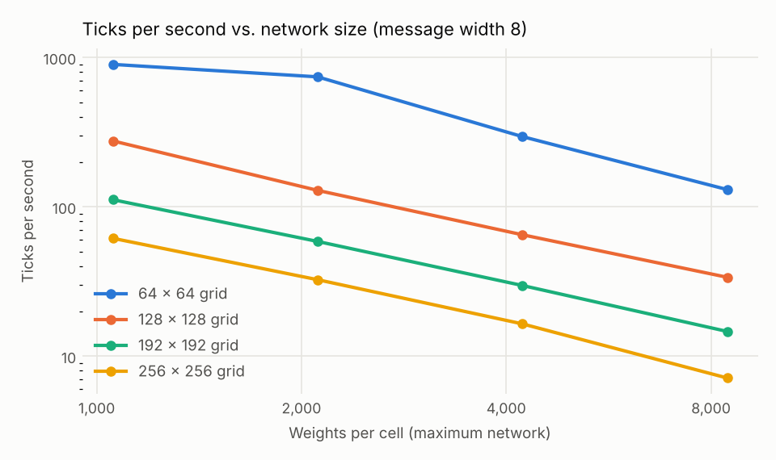
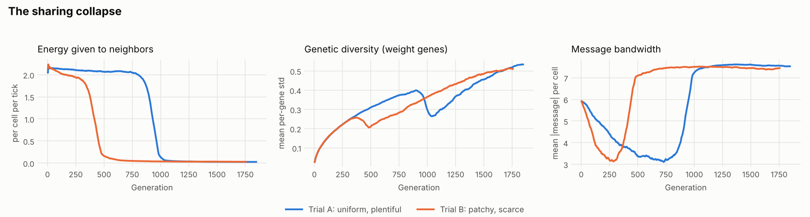
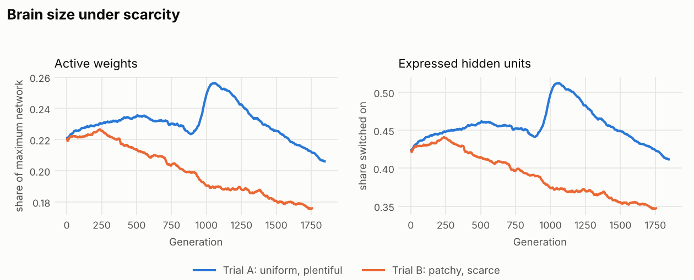
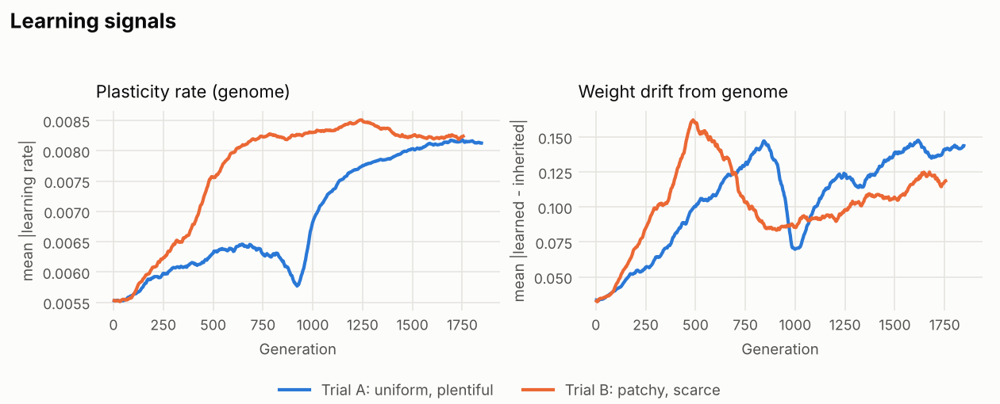
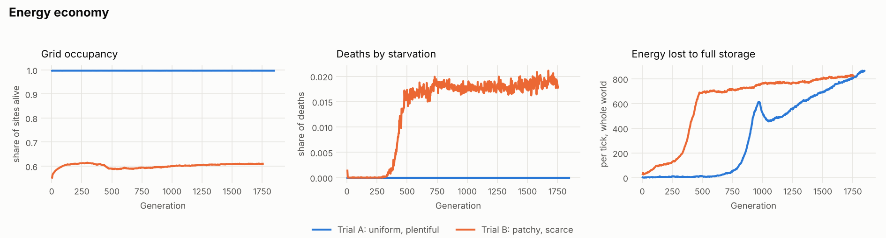

# Substrata Lab Notebook

A running record of experiments with Substrata, a cellular automaton whose cells learn, form collectives, and evolve how they learn. Newest entries at the bottom. Each entry states what was run, what happened, and what it might mean, keeping observations separate from interpretation.

- Design and assumptions: [docs/design-principles.md](../docs/design-principles.md)
- Charts: `reports/figures/`, rebuilt with `python reports/make_charts.py charts`
- Data behind the charts: `reports/data/` (smoothed, one row per 500 ticks)

---

## Findings so far

Status key: **observed** (seen in data), **supported** (seen more than once, or with a control), **open** (a hypothesis not yet tested).

1. **Sharing collapses once lineages diverge.** *Supported (2 of 2 worlds).* Cells gave about 2 energy per tick to their neighbors for hundreds of generations, then a non-sharing lineage swept the population and giving fell to almost zero. It happened in both trial A (generation ~850 to 1,000) and trial B (~300 to 500).
2. **Kin selection explains the collapse.** *Open.* Sharing is cheap when neighbors are relatives and costly when they aren't. Test: the Layer 3 "off" control keeps every cell a clone, so this predicts sharing never collapses there.
3. **Scarcity shrinks brains.** *Observed (trial B).* Under patchy, scarce energy, the share of the network in use fell steadily (active weights 0.22 to 0.18). With plentiful energy (trial A) it did not fall until late in the run.
4. **Sharing was feeding the frontier.** *Observed (trial B).* Starvation began exactly when sharing collapsed, and occupancy dipped. Before the collapse, energy passed from rich patches kept edge cells alive.
5. **Both worlds converged on a similar plasticity rate.** *Observed, with a caveat.* The genome's learning rate rose about 50% in both runs and leveled near 0.0082. The ceiling built into the engine is 0.01, so the plateau may be that ceiling rather than an optimum.
6. **Does learning pay?** *Open; test running.* Trial B with plasticity off is the comparison.

---

## Entry 1: GPU benchmark (2026-10-06)

**Setup.** A stand-in tick with the same cost shape as the engine (neighbor messages, per-cell networks with genome masks, a plasticity update on every weight, energy bookkeeping), timed across grid sizes 64 to 256, hidden widths 8 to 64 and message widths 4 to 16 on the RTX 4070 Super.

**Observed.**
- Throughput is about 4.5 billion weight updates per second, roughly the same however it is split between number of cells and network size.
- Memory only binds at the largest case (256 x 256, hidden 64, message 16: 11.3 GB, 1.3 ticks per second).
- The plasticity update dominates the cost, since it rewrites every weight every tick.

**Decision.** Option A: 128 x 128 grid, hidden 32, message 8 (about 65 ticks per second in the benchmark, about 38 in the full engine).

---

## Entry 2: Trial A, uniform plentiful energy (2026-10-06)

**Setup.** 128 x 128 torus, uniform inflow 0.5 per site per tick, one random genome cloned into 30% of sites, plasticity on, Layer 3 on (mutation rate 0.02), no bonds. 300,000 ticks, about 1,840 generations. Run `trial_a_20261006-134953`.

**Observed.**
- The grid filled within a few hundred ticks and stayed about 99.7% full. No cell ever starved; every death was from old age. Space, not energy, was the limit.
- Generation time was about 160 ticks, about half the 300-tick lifespan, because cells reproduce as soon as a neighbor dies.
- **Generations 850 to 1,000:** energy given to neighbors fell from 2.0 to 0.03 per cell per tick and never recovered. Genetic diversity dropped about 30% during the same window, then rebuilt to above its earlier level by the end of the run. Message bandwidth doubled (3.2 to 7.5) at the same moment and stayed high.
- Energy lost to full storage climbed sharply after the collapse: cells that stopped giving filled their tanks.
- The winning lineage briefly had larger networks (active weights spiked to 0.26), which then shrank steadily for the rest of the run.

**Interpretation.**
- The diversity dip and recovery is the signature of a selective sweep: one lineage, carrying the trait that mattered, took over and then diversified.
- Not sharing was the trait that mattered. A cell that keeps its energy returns to the reproduction threshold sooner and wins more of the freed sites.
- The bandwidth jump is most likely hitchhiking: the winning lineage happened to message loudly, and messages are cheap. Nothing yet shows messages carry useful information.

**Against the trial criteria.** Floor met (alive, turnover continued, no frozen monoculture). Learning paying off not tested. Structure beyond chance not applicable (no bonds yet).

---

## Entry 3: Trial B, patchy scarce energy (2026-10-06)

**Setup.** As trial A, except mean inflow 0.35 arranged in smooth rich patches and poor zones (contrast 0.8, patch scale 16). About 39% of site-ticks fall below what a typical early cell spends. 300,000 ticks, about 1,755 generations. Run `trial_b_20261006-160817`.

**Observed.**
- The world held about 10,000 cells (about 60% of sites). The poor zones stayed mostly empty. Cells sat on inflow about 1.4 times the grid average, which reflects where cells can survive rather than a choice, since cells cannot move.
- **Sharing collapsed again**, earlier than in trial A: from about 2.0 to near zero between generations 300 and 500, with the same diversity dip and recovery and the same bandwidth jump.
- **Starvation began at the collapse.** Before generation ~300 essentially no cell starved. Afterward about 2% of deaths were starvation, occupancy dipped from 0.61 to 0.59, and energy lost to full storage jumped in the rich patches.
- Brains shrank steadily from generation ~250 on: active weights 0.22 to 0.18, expressed hidden units 0.43 to 0.35.

**Interpretation.**
- The same event in two different worlds makes the collapse a property of the system, not an accident of one run.
- It came sooner under scarcity. Sharing is more costly when energy is tight, so the selfish strain's advantage was larger.
- Sharing had been doing real work: it carried energy from the rich patches to the frontier. When it went, the frontier starved and the rich patches overflowed. The population as a whole became less efficient, even though each selfish lineage did better. This is the classic shape of a tragedy of the commons.
- Brains shrink when compute costs energy that is actually scarce. That is the pressure toward efficient networks the substrate was designed to create.

**Caveat on learning.** The plasticity rate rose in both runs and leveled near 0.0082 against a built-in ceiling of 0.01. Weight drift (how far learned weights move from the inherited ones) rose and fell with the sweeps. Neither shows that learning helps. Raising the ceiling would tell whether the plateau is the ceiling or a real optimum.

---

## Entry 4: Trial B, plasticity off (running)

**Setup.** Identical to trial B, with Layer 1 learning switched off: cells live their whole lives with the weights they inherited.

**Question.** Does learning during life pay in a patchy, scarce world? If it does, the plasticity-on world should hold more cells, more energy, or both.

*Results and figure 5 to be added when the run finishes.*

---

## Open questions and next experiments

| Question | Test | Status |
|---|---|---|
| Does learning during life pay? | Trial B vs. trial B with plasticity off | Running |
| Is the sharing collapse kin selection? | Ladder B (Layer 3 off, everyone stays a clone): sharing should persist | Queued |
| Is the plasticity plateau a ceiling? | Rerun trial B with `layers.eta_scale = 0.05` | Idea |
| Can bonds rescue cooperation? | Build Layer 2 (bonds with shared energy pools); rerun trial B | Next build |
| Do changing conditions favor learners? | Trial C (travelling season, 600-tick cycle); sweep the period | Ready |
| Do messages carry information? | Shuffle messages between cells mid-run; does anything change? | Idea |
